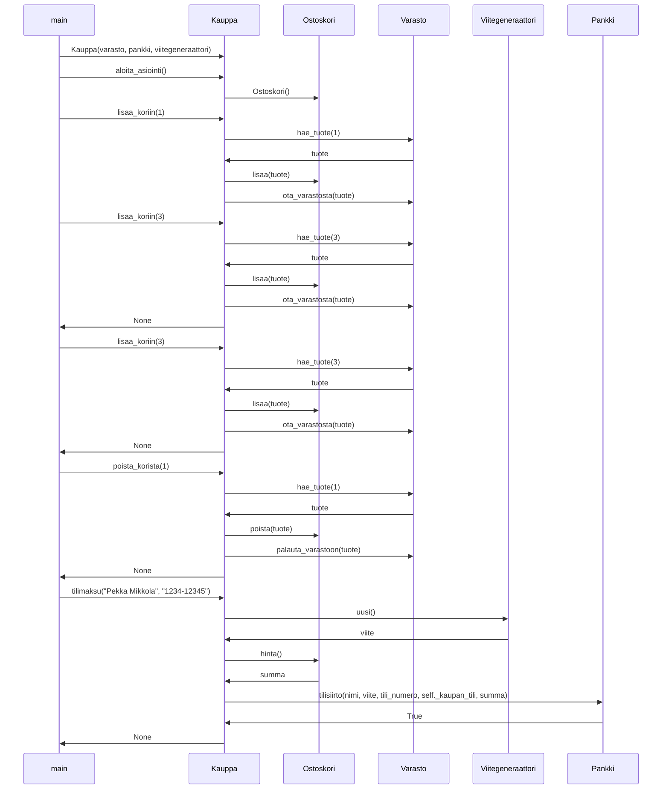

```mermaid
sequenceDiagram
  participant main
  participant Kauppa
  participant Ostoskori
  participant Varasto
  participant Viitegeneraattori
  participant Pankki
  main->>Kauppa: Kauppa(varasto, pankki, viitegeneraattori)
  main->>Kauppa: aloita_asiointi()
  Kauppa->>Ostoskori: Ostoskori()
  main->>Kauppa: lisaa_koriin(1)
  Kauppa->>Varasto: hae_tuote(1)
  Varasto->>Kauppa: tuote
  Kauppa->>Ostoskori: lisaa(tuote)
  Kauppa->>Varasto: ota_varastosta(tuote)
  main->>Kauppa: lisaa_koriin(3)
  Kauppa->>Varasto: hae_tuote(3)
  Varasto->>Kauppa: tuote
  Kauppa->>Ostoskori: lisaa(tuote)
  Kauppa->>Varasto: ota_varastosta(tuote)
  Kauppa->>main: None
  main->>Kauppa: lisaa_koriin(3)
  Kauppa->>Varasto: hae_tuote(3)
  Varasto->>Kauppa: tuote
  Kauppa->>Ostoskori: lisaa(tuote)
  Kauppa->>Varasto: ota_varastosta(tuote)
  Kauppa->>main: None
  main->>Kauppa: poista_korista(1)
  Kauppa->>Varasto: hae_tuote(1)
  Varasto->>Kauppa: tuote
  Kauppa->>Ostoskori: poista(tuote)
  Kauppa->>Varasto: palauta_varastoon(tuote)
  Kauppa->>main: None
  main->>Kauppa: tilimaksu("Pekka Mikkola", "1234-12345")
  Kauppa->>Viitegeneraattori: uusi()
  Viitegeneraattori->>Kauppa: viite
  Kauppa->>Ostoskori: hinta()
  Ostoskori->>Kauppa: summa
  Kauppa->>Pankki: tilisiirto(nimi, viite, tili_numero, self._kaupan_tili, summa)
  Pankki->>Kauppa: True
  Kauppa->>main: None
```
